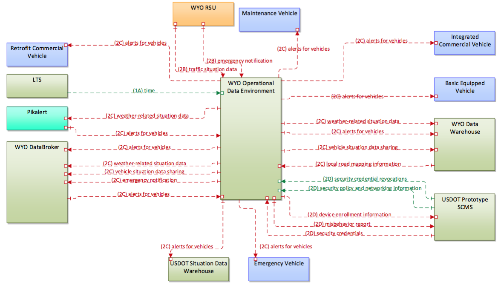

Master: [](https://travis-ci.org/usdot-jpo-ode/jpo-ode) [](https://sonarqube.com/dashboard/index?id=us.dot.its.jpo.ode/jpo-ode)

# jpo-ode
US Department of Transportation Joint Program office (JPO) Operational Data Environment (ODE)



## Project Description
In the context of ITS, an Operational Data Environment is a real-time data acquisition and distribution software system that processes and routes data from Connected-X devices –including connected vehicles (CV), personal mobile devices, and infrastructure components and sensors –to subscribing applications to support the operation, maintenance, and use of the transportation system, as well as related research and development efforts.

This project is currently working with the Wyoming Department of Transportation (WYDOT) as one of the Connected Vehicle (CV) Pilot sites
to showcase the value of and spur the adoption of CV Technology in the United States.

As one of the three selected pilots, WYDOT is focusing on improving safety and mobility by creating new ways to communicate road and travel information to commercial truck drivers and fleet managers along the 402 miles of Interstate 80 (I-80 henceforth) in the State. For the pilot project, WYDOT will work in a planning phase through September 2016. The deployment process will happen in the second phase (ending in September 2017) followed by an 18-month demonstration period in the third phase (starting in October 2017).

## Project Goals
The current project goals for the ODE have been developed specifically for the use case of WYDOT. Additional capabilities and system functions are planned for later releases.

- **Collect CV Data:** Connected vehicle data from field may be collected from vehicle OBUs directly or through RSUs. Data collected include Basic Safety Messages Part I and Part 2, Event Logs and other probe data (weather sensors, etc.). These messages are ingested into the operational data environment (ODE) where the data is then further channeled to other subsystems.
- **Support Data Brokerage:** The WYDOT Data Broker is a sub-system that is responsible for interfacing with various WYDOT Transportation Management Center (TMC) systems gathering information on current traffic conditions, incidents, construction, operator actions and road conditions. The data broker then distributes information from PikAlert, the ODE and the WYDOT
interfaces based on business rules. The data broker develops a traveler information message (TIM) for segments on I-80, and provide event or condition information back to the WYDOT interfaces
- **Distribute traveler information messages (TIM):** The data broker distributes the TIM message to the operational data environment (ODE) which will then communicate the message back to the OBUs, RSUs and the situational data warehouse (SDW)
- **Store data:** Data generated by the system (both from the field and the back-office sub-systems)
are stored in the WYDOT data warehouse.


 
## Release Notes
### Release 1.0

## Collaboration Tools

### Source Repository - GitHub
https://github.com/usdot-jpo-ode/jpo-ode

### Agile Project Management - Taiga
https://tree.taiga.io/project/toryb-its_jpo_ode_agile/

### Wiki - Taiga
https://tree.taiga.io/project/toryb-its_jpo_ode_agile/wiki/home

### Continuous Integration and Delivery
https://travis-ci.org/usdot-jpo-ode/jpo-ode

## Getting Started

### Local Build

###### Dependencies

You will need the following dependencies to run the application:

* Maven: [https://maven.apache.org/install.html](https://maven.apache.org/install.html)

IDE of your choice:

* IntelliJ: [https://www.jetbrains.com/idea/](https://www.jetbrains.com/idea/)
* STS: [https://spring.io/tools/sts/all](https://spring.io/tools/sts/all)
* Eclipse: [https://eclipse.org/](https://eclipse.org/)

Private Jars:

* ASN.1 BSM Encoder/Decoder: To receive the private jar, please contact the development team.


#### Clone the Repo

Please request access if needed, but with a git client or the command line, you can clone repo.

```
git clone https://github.com/usdot-jpo-ode/jpo-ode.git
```

#### Building and Running the project

To build the project using maven command line:

Navigate to the root directory

```
cd jpo-ode/
```

Build the project, downloading all of the JAR needed and compiling the code

```
mvn clean install
```


Navigate to the project folder supporting the service

```
cd /jpo-ode-svcs
````

Run the script to establish a local Spring instance

```
sh run.sh
```

You should be able to access the running service at `localhost:8080`, but submissions will not work without the ASN.1 Jar installed locally.

Once you have a jar installed with the project, you should be able to upload the following file and test for a successful output. 

```json
{
	"coreData": {
		"position":	{
				"latitude":42.3288028,
				"longitude":-83.048916,
				"elevation":157.5
		}
	}
}
```

And the output:

```
2016-11-29 10:52:13.793  INFO 6449 --- [nio-8080-exec-2] u.d.i.j.o.s.FileSystemStorageService     : AExMjM0AAFrSdJU1pOjWCE6AAAAAAAUAAH59B9B/f/8AAAUAUAAAAAAAAAAAAAAAAAAAAAAAAAAAAAAAAAAAAA==

2016-11-29 10:52:13.794  INFO 6449 --- [nio-8080-exec-2] u.d.i.j.o.s.FileSystemStorageService     : Latitude: 0.0000042

2016-11-29 10:52:13.794  INFO 6449 --- [nio-8080-exec-2] u.d.i.j.o.s.FileSystemStorageService     : Longitude: -0.0000083

2016-11-29 10:52:13.795  INFO 6449 --- [nio-8080-exec-2] u.d.i.j.o.s.FileSystemStorageService     : Elevation: 15.7
```

Which demonstrates a loop of Readable JSON -> ASN.1 UPER encoded BSM Message -> Readable Output


### Continuous Integration and Delivery

### Deployment

## Docker
docker/README.md
